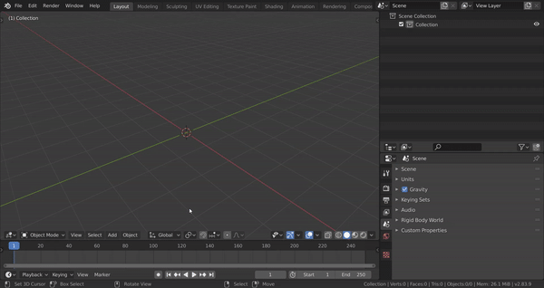

**Note**: CloudRig is currently in a pre-release state, and backwards compatibility is not guaranteed as I make commits. 
That is to say, you should always keep a backup before updating, so in case your rigs don't generate the way they should, you can roll back if needed.

# What is CloudRig?
CloudRig or CloudRigify is a custom featureset package for the Rigify Blender addon, developed for the Blender Animation Studio in-house, with the help of professional animators.

#### Wait, what is Rigify?
Rigify is a Blender addon which allows you to generate rigs from smaller building blocks (rig elements).
It is somewhat of a step between rigging a character from scratch, bone by bone(easy to customize, lots of effort) versus adjusting a completely pre-built rig to your character's proportions (hard to customize, low time investment).

So, CloudRig is a collection of such building blocks, which you can use with the Rigify addon. This page will assume that you never used Rigify before.

# Installing CloudRigify
Download this repository as a .zip, or grab the latest release from the Releases page.
Open Blender 2.8 or higher. In the Preferences, enable the Rigify addon. Rigify comes with Blender, so you don't need to download it.
While you're there in the Rigify addon preferences, open the "Rigify: External feature sets" sub-panel, and then click "Install Feature Set from File..."
<put screenshot here>

# Using CloudRigify
The easiest way to get started is to add the pre-built human metarig by simply doing Shift+A->Armature->Cloud Human (Metarig).
Next, you can generate this rig via Properties->Object Data->Rigify Buttons->Generate Rig.
And bam, you have a rig!  
  

You can try moving around the bones in the Metarig in edit mode, and then generating again, to see the rig re-generated to the new proportions.

### Customization Level 1
I mentioned building blocks previously, so where are those? Go in pose mode on the Metarig, and select the UpperArm.L bone. Then go to Properties->Bone->Rigify Type.
You should find that the rigify type of this bone is "cloud_limbs". More importantly, you can find a fair few parameters to customize this rig element. Play with those parameters and re-generating the rig, to see what they do. I also tried to give them useful descriptions, so you can just mouse-over them and read the tooltip.
Do note that rig elements can have certain requirements, such as a specific number of children connected in a chain. For example, if you tried to subdivide one of the arm bones and then generate, you will get this generation error:
Error: Generation has thrown an exception: Arm chain must be exactly 3 connected bones.

I try to design the rig elements with as few of these requirements as possible.

You are technically allowed to mix CloudRigify and regular Rigify elements in the same rig. I would advise against this, however, because CloudRigify handles its UI very differently from regular Rigify.
Speaking of which...

# Rig UI
Once generated, select your generated rig, and press the N key to bring up the Sidebar. You should see a CloudRig tab

**Bone shape sizes**
When you actually try applying your rig to your character, you might find that some bone shapes are too small or too large for your liking.
To help with this, put the Metarig's Viewport Display type to B-Bone.
<screenshot>
Now, try scaling a bone's BBone display size, using Ctrl+Alt+S shortcut. You can do this in either pose or edit mode, it doesn't matter. Then re-generate the rig.
You should see that the BBone scale of the Metarig bone affected the controls generated for that bone.

**Bone Group Colors**
When you generate a rig for the first time, the CloudRigify bone groups will not only be created on the generated rig, but also on the Metarig.
You can feel free to change the bone group colors on the Metarig. Next time you generate, those colors will be used instead of the default ones.
If you changed a bone group color and would like to reset it to default, simply delete it from the Metarig. It will be re-created with default values next time you generate.

Renaming bone groups on the metarig will have the same effect as deleting them.

<todo write more things>
