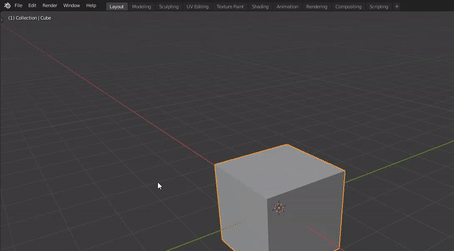
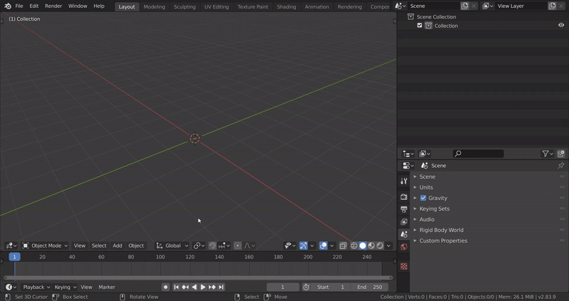
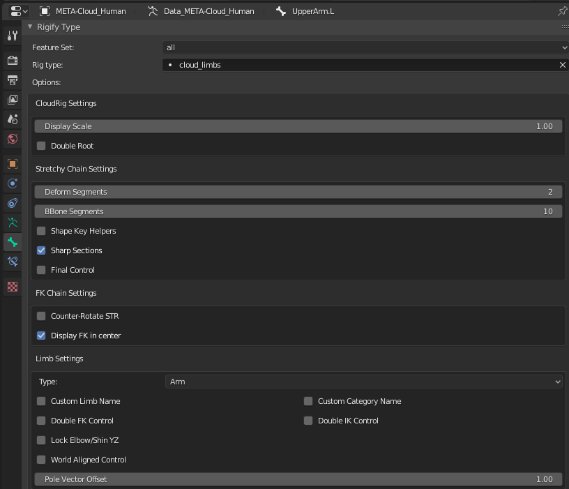
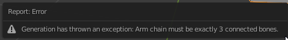
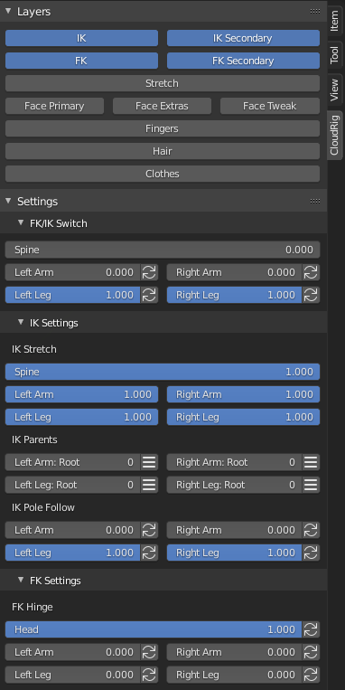

**Note**: CloudRig is currently a work in progress.
Here are some of the major things that still need to be done:
- Layer assignment override on the Generator level for all ORG, DEF and mechanism bones, for less cluttered "Bone Sets".
- Update all rig samples.

And that's not to mention dozens of smaller tasks, as well as adding more rig elements, like face setups. So use with care!

# What is CloudRig?
CloudRig is a custom featureset package for the Rigify Blender addon, developed for the Blender Animation Studio in-house, with the help of professional animators.

#### Wait, what is Rigify?
Rigify is a Blender addon which allows you to generate rigs from smaller building blocks (rig elements).
It is somewhat of a step between rigging a character from scratch, bone by bone(easy to customize, lots of effort) versus adjusting a completely pre-built rig to your character's proportions (hard to customize, low time investment).

So, CloudRig is a collection of such building blocks, which you can use with the Rigify addon. This page will assume that you never used Rigify before.

# Installing CloudRig
Download this repository as a .zip via the "Clone or download" button.
In Blender, open Preferences->Addons and enable the Rigify addon. Rigify comes with Blender, so you don't need to download it.
While you're there in the Rigify addon preferences, open the "Rigify: External feature sets" sub-panel, and then click "Install Feature Set from File..." and browse the .zip you downloaded.  
  

# Using CloudRig
The easiest way to get started is to add the pre-built human metarig by simply doing Shift+A->Armature->Cloud Human (Metarig).
Next, you can generate this rig via Properties->Object Data->Rigify Buttons->Generate Rig.
And bam, you have a rig!  
  

You can try moving around the bones in the Metarig in edit mode, and then generating again, to see the rig re-generated to the new proportions.

CloudRig only helps you up to this stage in the rigging process - Weight Painting is still ahead of you. All the deform bones are on a single layer. You will have to weight paint your character to these bones using whatever your preferred workflow is.

### Rig Elements
In order to customize a rig element, try selecting the "UpperArm.L" bone in pose mode. Then go to Properties->Bone->Rigify Type. You should find this interface:  
  

This shows the type of rig element applied to this bone, in this case "cloud_limbs". Below that, all of the parameters you can use to customize that rig element. Play with those parameters and re-generating the rig, to see what they do.  

Rig elements can have certain requirements, such as a specific number of children connected in a chain. For example, if you tried to subdivide one of the arm bones and then generate, you will get this generation error:  

  

While it is possible to mix CloudRig and regular Rigify elements in the same rig, I would advise against this because CloudRig handles its [UI](#rig-ui) differently from regular Rigify, so if you tried using both, you might end up with two separate rig UIs.

### Bone Display Size
You might often encounter that the sizes of the bone shapes are too big or too small for some parts of your character. This can result in an eye sore, or worse, important controls only being visible with Bone X-Ray. For this reason, all CloudRig elements' bone shapes will scale according to the BBone scale of the bone in the metarig. You can adjust the BBone scale of bones using Ctrl+Alt+S, but only if your armature's bone display type is set to BBone. This will not affect any behaviour on the rig, it's purely for visual aid.

### Bone Group Colors
When you generate a rig for the first time, the bone groups will not only be created on the generated rig, but also on the Metarig.
You can feel free to change the bone group colors on the Metarig. Next time you generate, those colors will be used instead of the default ones.
If you changed a bone group color and would like to reset it to default, simply delete it from the Metarig. It will be re-created with default values next time you generate.

# Rig UI
Once generated, select your generated rig, and press the N key to bring up the Sidebar. You should see a CloudRig tab, which contains the rig UI. This is where the animators will be able to find rig settings, as well as a handy layer selector.  
  

Note that unlike regular Rigify, the CloudRig UI is not context-sensitive. All rig options are displayed at all times, regardless of your selection.