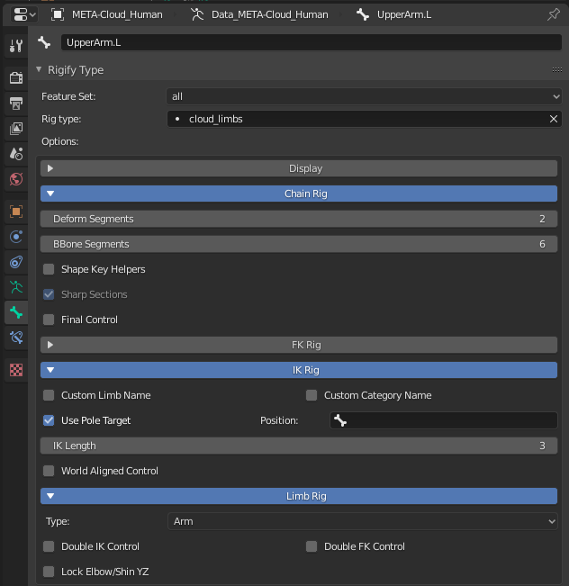

# What is CloudRig?
CloudRig is a custom featureset package for the [Rigify](https://docs.blender.org/manual/en/latest/addons/rigging/rigify/introduction.html) Blender addon, developed for the Blender Animation Studio in-house, with the help of professional animators.

Put another way, CloudRig is a collection of customizable rig building blocks That can be added to Rigify.

# Installing CloudRig
Download this repository as a .zip via the "Clone or download" button.
In Blender, open **Preferences->Addons->Rigify** and enable the addon. Rigify comes with Blender, so you don't need to download it.
In the Rigify addon preferences, click on **Rigify: External feature sets->Install Feature Set from File...** and browse the .zip you downloaded.  
  

# Using CloudRig
The easiest way to get started is to add the pre-built human metarig via **Add->Armature->Cloud Human (Metarig)**.
Next, you can generate this rig via **Properties->Object Data->Rigify Buttons->Generate Rig**.
And bam, you have a rig!  
  

You can try moving around the bones in the Metarig in edit mode, and then generating again, to see the rig re-generated to the new proportions.

CloudRig only helps you up to this stage in the rigging process - Weight Painting is still ahead of you. All the deform bones are on a single layer. You will have to weight paint your character to these bones using whatever your preferred workflow is.

### Rig Elements
In order to customize a rig element, try selecting the "UpperArm.L" bone in pose mode. Then go to Properties->Bone->Rigify Type. You should find this interface:  
  

This shows the type of rig element applied to this bone, in this case "cloud_limbs". Below that, all of the parameters you can use to customize that rig element. After changing the parameters, simply press Generate again to update the rig.

For more information, see the wiki:
- [CloudRig Types](../../../wiki/CloudRig-Types)
- [Generator Parameters](../../../wiki/Generator-Parameters)
- [Custom Properties](../../../wiki/Custom-Properties)
- [Organizing Bones](../../../wiki/Organizing-Bones)

# Rig UI
Once generated, select your generated rig, and press the N key to bring up the Sidebar. You should see a CloudRig tab, which contains the rig UI. This is where the animators will be able to find rig settings and a layer selector.  
  

Note that unlike regular Rigify, the CloudRig UI is not context-sensitive. All rig options are displayed at all times, regardless of your selection.